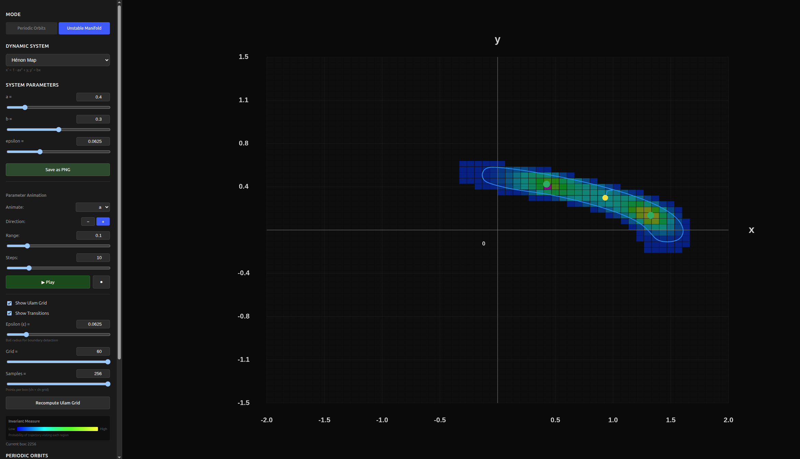
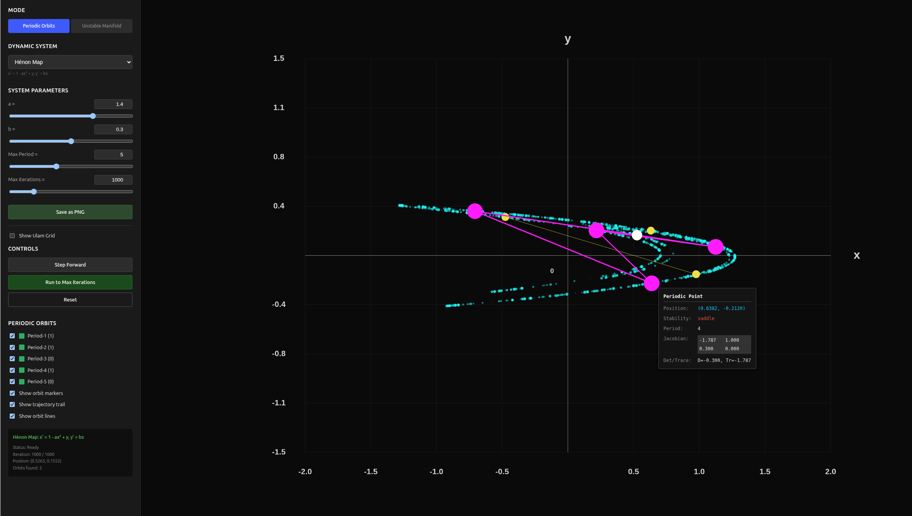

# Visualization of Set-valued Dynamical System
Iteractive web-based visualization tool for exploring set-valued dynamical systems with bounded noise, developed as part of the Advanced Computing Project (ACP2) research course at the University of Oulu.
## Mathematical Bacground
In classical analysis, a **single-valued function** (or simply a function) $f: X \to Y$ assigns each point $x \in X$ to exactly one point $y \in Y$, written $y = f(x)$. Traditional dynamical systems using single-valued maps to describe deterministic evolution: given initial state $x_0$, the trajectory is uniquuely determined as $x_1 = f(x_0), x_2 = f(x_1), x_3= f(x_2)$ and so forth.

In contrast, a **set-valued function** (or **multivalued map**) $F: X \to \mathcal{(Y)}$ assigns to each point $x \in X$ a **subset** $F(x) \subseteq Y$ where $\mathcal{P}(Y)$ denotes the power set of $Y$. Rather than producing a single output, set-valued functions produce **a set of possible outputs**:

$F(A) = \bigcup_{x \in A} F(x)$
In our setting, we model bounded additive noise through set-valued map:
$F(x) = B_\epsilon(f(x)) = \{f(x) + \xi : \|\xi\| \leq \epsilon\}$ where $f: \mathbb{R}^n \to \mathbb{R}^n$ is the underlying single-valued deterministic map (the Hénon map in our case), and $B_\epsilon(f(x))$ represent all possible perturbed states within distance $\epsilon$ of the deterministic image.

Rather than tracking every possible point within the noise ball $B_\epsilon(f(x))$ which would too computationally expensive to compute as the noise balls grow, we instea adopt a **worse-case boundary approach**. Since the maximum uncertainty occurs at the boundary $\partial B_\epsilon(f(x))$ (points at distance exactly $\epsilon$ from the deterministic image), we focus exclusively on tracking how these boundary points evolve.




### An example of a 4-periodic point found with A = 1.4 and B = 0.3

## **Getting Started**
### **1. Clone the Repository**

```bash
git clone <repository-url>
cd set-valued-viz
```

### **2. Build WebAssembly Module**

```bash
# Build the Rust code to WebAssembly
wasm-pack build --target web --out-dir pkg
```

This creates the WebAssembly module in the `pkg/` directory.

### **3. Install Frontend Dependencies**

```bash
cd frontend
npm install
```

### **4. Copy WASM Files to Frontend**

```bash
# Copy WebAssembly files to the frontend source
npm run build-wasm
```

**Alternative:** Manual copy if the npm script doesn't work:
```bash
cp -r ../pkg/* src/pkg/
```

### **5. Start Development Server**

```bash
npm run dev
```
