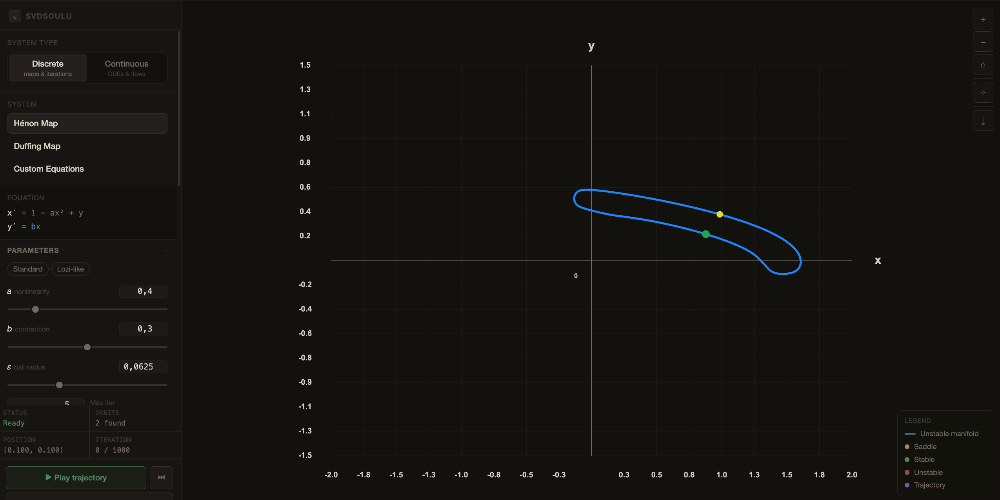
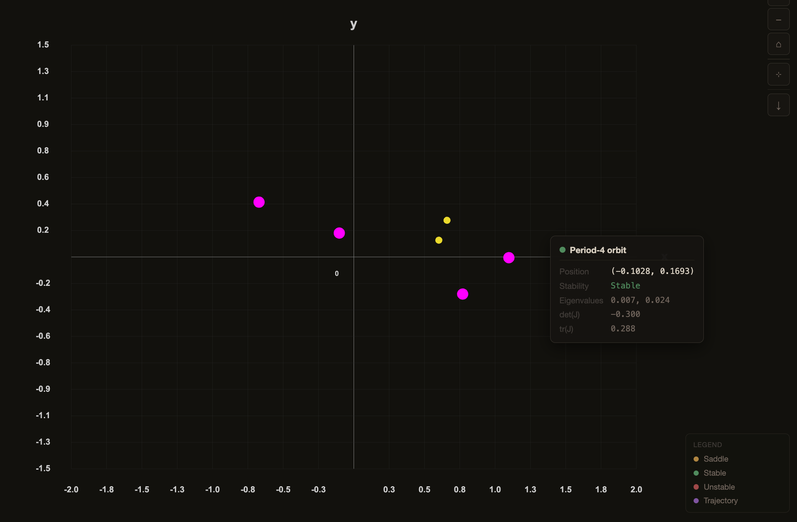
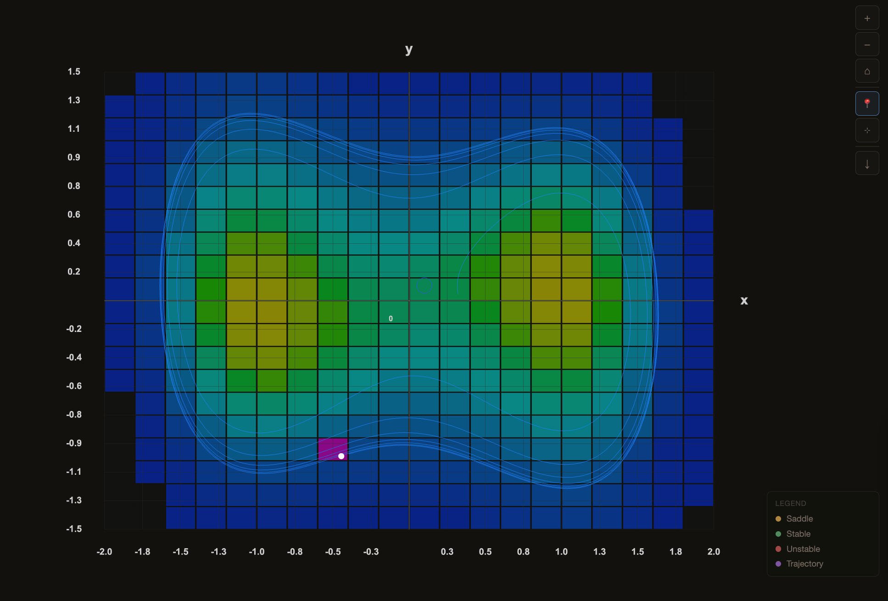
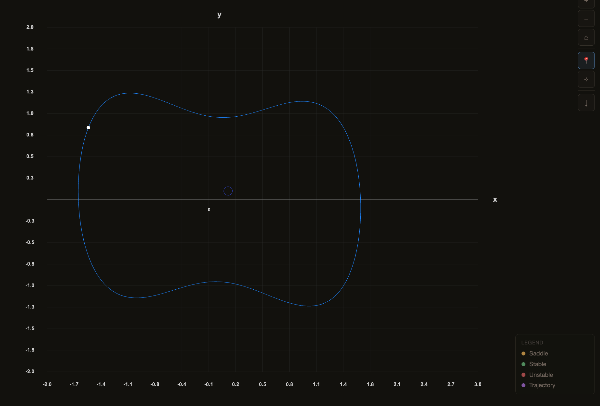
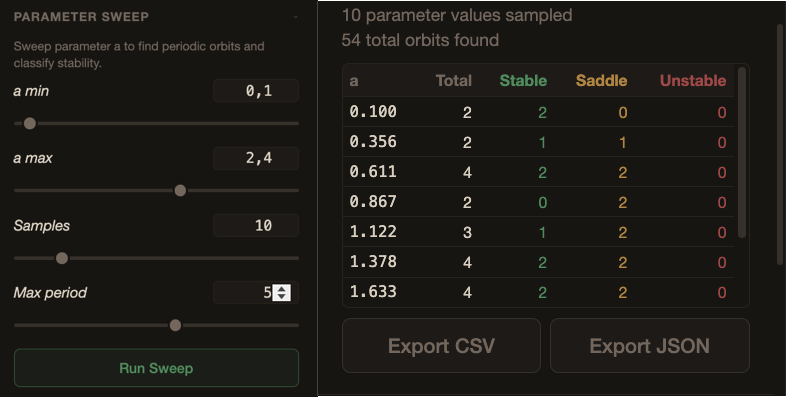

# Bounded Invariant Set Toolbox (BIST)

<div align="center">
  
</div>

Iteractive web-based visualization tool for exploring set-valued dynamical systems with additive bounded noise, developed as part of the Advanced Computing Project (ACP2) research course at the University of Oulu.

#### Live at: [https://namvdo.github.io/set-valued-viz](https://namvdo.github.io/set-valued-viz)

## Mathematical Background

In classical analysis, a **single-valued function** (or simply a function) $f: X \to Y$ assigns each point $x \in X$ to exactly one point $y \in Y$, written $y = f(x)$. Traditional dynamical systems using single-valued maps to describe deterministic evolution: given initial state $x_0$, the trajectory is uniquuely determined as $x_1 = f(x_0), x_2 = f(x_1), x_3= f(x_2)$ and so forth.

In contrast, a **set-valued function** (or **multivalued map**) $F: X \to \mathcal{(Y)}$ assigns to each point $x \in X$ a **subset** $F(x) \subseteq Y$ where $\mathcal{P}(Y)$ denotes the power set of $Y$. Rather than producing a single output, set-valued functions produce **a set of possible outputs**:

$F(A) = \bigcup_{x \in A} F(x)$
In our setting, we model bounded additive noise through set-valued map:
$F(x) = B_\epsilon(f(x)) = \{f(x) + \xi : \|\xi\| \leq \epsilon\}$ where $f: \mathbb{R}^n \to \mathbb{R}^n$ is the underlying single-valued deterministic map (the Hénon map in our case), and $B_\epsilon(f(x))$ represent all possible perturbed states within distance $\epsilon$ of the deterministic image.

Rather than tracking every possible point within the noise ball $B_\epsilon(f(x))$ which would be computationally expensive to compute as the noise balls grow, we instead track the boundary evolution through an extended boundary map $F(x,y,nx,ny)=\bigl(f(x,y)+\varepsilon\,\mathbf{nx}',\mathbf{ny}'\bigr)$. Since the maximum uncertainty occurs at the boundary $\partial B_\epsilon(f(x))$ (points at distance exactly $\epsilon$ from the deterministic image), we focus exclusively on tracking how these boundary points evolve.

### Unstable manifold visualization for boundary map evolution with a=0.4, b=0.3 and epsilon=0.0625



### An example of a 4-periodic point found for the boundary map with A = 1.4 and B = 0.3, epsilon=0.0625



### ULAM method integration for stationary measure in continuous dynamical systems



### Continuous boundary differential equation simulation



### Parameter sweeping for finding fixed and periodic orbits for boundary map of the discrete dynamical systems



## **Getting Started**

### **1. Clone the Repository**

```bash
git clone <repository-url>
cd set-valued-viz
```

### **2. Build WebAssembly Module**

```bash
cd frontend && npm install && npm run build-wasm
```

This creates the WebAssembly module in the `pkg/` directory and compiled the Rust code to WebAssembly so it can be used in JavaScript side.

### **3. Start the frontend server**

```bash
cd frontend && npm install && npm run dev
```

## License

MIT License — see [LICENSE](./LICENSE) for the full text.

Permission is hereby granted, free of charge, to any person obtaining a copy of this software and associated documentation files (the "Software"), to deal in the Software without restriction, including without limitation the rights to use, copy, modify, merge, publish, distribute, sublicense, and/or sell copies of the Software, and to permit persons to whom the Software is furnished to do so, subject to the following conditions:

The above copyright notice and this permission notice shall be included in all copies or substantial portions of the Software.

THE SOFTWARE IS PROVIDED "AS IS", WITHOUT WARRANTY OF ANY KIND, EXPRESS OR IMPLIED, INCLUDING BUT NOT LIMITED TO THE WARRANTIES OF MERCHANTABILITY, FITNESS FOR A PARTICULAR PURPOSE AND NONINFRINGEMENT. IN NO EVENT SHALL THE AUTHORS OR COPYRIGHT HOLDERS BE LIABLE FOR ANY CLAIM, DAMAGES OR OTHER LIABILITY, WHETHER IN AN ACTION OF CONTRACT, TORT OR OTHERWISE, ARISING FROM, OUT OF OR IN CONNECTION WITH THE SOFTWARE OR THE USE OR OTHER DEALINGS IN THE SOFTWARE.
